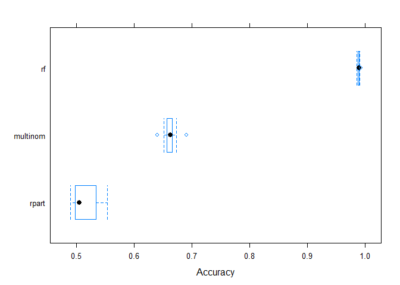

## Abstract

The goal of this project is to predict the manner in which volunteers performed physical exercises based on the measurements from sensors located on their bodies. The full data description is available at <http://groupware.les.inf.puc-rio.br/har>. In this report we apply different machine learning algorithms, compare the models and predict a class of exercises for a testing set provided.

## Data Processing

At first we read in the data as follows:

```r
training_raw <- read.csv("pml-training.csv")
testing_final <- read.csv("pml-testing.csv")
```

We note that first few columns are unlikely to have any impact on the exercise class (namely "X", "user_name", "raw_timestamp_part_1", "raw_timestamp_part_2", "cvtd_timestamp", "new_window", and "num_window"). Moreover, multiple columns contains NA mostly, so we exclude them from our analysis. We also neglect columns that have near zero variance and thus do not contribute to the model. This post-processing should  hopefully significantly reduce computation time. 

To explore the data, we plot the histogram of classe, the exercise class that we are interested in. It can be seen, that all possible outcomes ("A", "B", "C", "D" and "E") have roughly the same frequency that is slighlt higher for A. Pairs graph for first five variables and classe for 30 random observations do not allow us to make an educated guess about a model, so a consistent machine learning technique should be applied.


```r
PMLdata <- training_raw %>% select(-X, -user_name, -raw_timestamp_part_1, -raw_timestamp_part_2, -cvtd_timestamp, -new_window, -num_window) %>% select_if(~!any(is.na(.)))
nearZeroVarCol <- nearZeroVar(PMLdata)

if (length(nearZeroVarCol) > 0) {
  PMLdata <- PMLdata %>% select(-all_of(nearZeroVarCol))
}
PMLdata$classe <- as.factor(PMLdata$classe)
plot(PMLdata$classe)
```

<!-- -->

```r
pairs(PMLdata[sample(1:19000, 20),c(1:5, 53)])
```

<!-- -->

```r
set.seed(71934)
inTrain = createDataPartition(PMLdata$classe, p = 0.70)[[1]]
training <- PMLdata[ inTrain,]  
testing = PMLdata[-inTrain,]
```
 At last, we separate the data into a training set (70%) and a testing set (30%). Therefore, our training and testing sets contain 13737 and 5885 samples respectively. The latter will be used to estimated out-of-sample error.
 
## Modelling

The problem the project aims at is essentially a classification problem. We will consider a few models to describe our data. We start with a simple multinomial regression that relies on generalized linear model. We then apply rpart to build a decision tree. Finally, we consider a random forest for a more reliable modelling.


```r
models <- list()
pred <- list()
#Model calls
models$multinom <- train(classe ~., data = training, method = "multinom", trace = FALSE)
models$rpart <- train(classe ~., data = training, method="rpart")
models$rf <- train(classe ~., data = training, method = "rf")

pred$multinom <- predict(models$multinom, newdata = testing)
pred$rpart <- predict(models$rpart, newdata = testing)
pred$rf <- predict(models$rf, newdata = testing)
rs <- resamples(models)
```
## Analysis

The models under consideration can be compared with a following plot that summarizes accuracies obtained. It can be clearly seen that random forest has a by far superior performance that comes with corresponding computational costs. The results are also summarized in a table.


```r
bwplot(rs , metric = "Accuracy")
```

<!-- -->

```r
accuracy <- list()
accuracy$multinom <- confusionMatrix(data = pred$multinom, reference = testing$classe)$overall[[1]]
accuracy$rpart <- confusionMatrix(data = pred$rpart, reference = testing$classe)$overall[[1]]
accuracy$rf <- confusionMatrix(data = pred$rf, reference = testing$classe)$overall[[1]]
accuracy.df <- as.data.frame(accuracy)
accuracy.df %>% kbl() %>% kable_styling()
```

<table class="table" style="margin-left: auto; margin-right: auto;">
 <thead>
  <tr>
   <th style="text-align:right;"> multinom </th>
   <th style="text-align:right;"> rpart </th>
   <th style="text-align:right;"> rf </th>
  </tr>
 </thead>
<tbody>
  <tr>
   <td style="text-align:right;"> 0.6526763 </td>
   <td style="text-align:right;"> 0.4931181 </td>
   <td style="text-align:right;"> 0.9923534 </td>
  </tr>
</tbody>
</table>
## Conslusions

We conclude that the best model from three we have considered is random forest with an accuracy of 0.99 measured on the test set. We use it to predict outcomes for the testing set for 20 unclassified observations and get following results:


```r
predict(models$rf, testing_final)
```

```
##  [1] B A B A A E D B A A B C B A E E A B B B
## Levels: A B C D E
```
